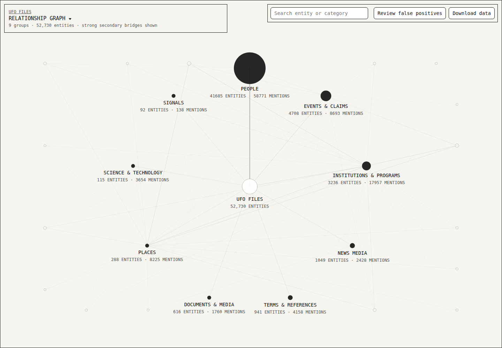
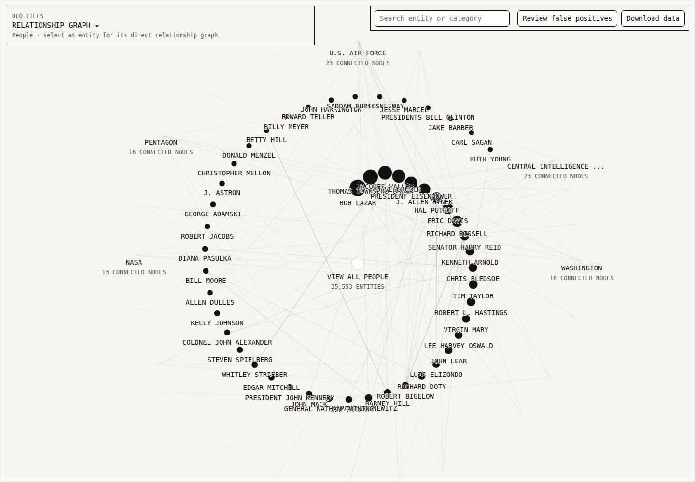
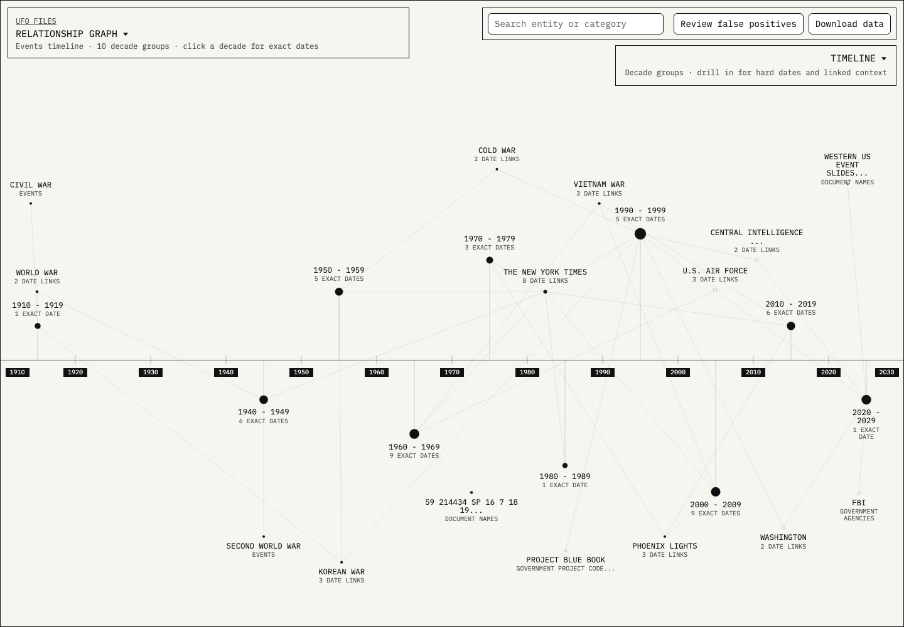

# UFO Files Relationship Graph

[](https://github.com/ufo-files/relationship-graph/actions/workflows/validate.yml)
[](https://github.com/ufo-files/relationship-graph/actions/workflows/rebuild-report.yml)
<!-- dataset-badges:start -->


<!-- dataset-badges:end -->

A static, browser-based relationship graph for exploring entities and connections extracted from a corpus of UAP-related transcripts.

Live site: https://ufo-files.github.io/relationship-graph/

Repository: https://github.com/ufo-files/relationship-graph

Source data repository: https://github.com/ufo-files/data

## Screenshots

### Main Graph



### People View



### Event Timeline



## What It Does

The app turns transcript-derived entities into an interactive graph. Categories form the outer structure, entities live inside those categories, and relationships are drawn from co-occurrence and corpus evidence.

The current export includes:

- 303 transcript sources
- 217,018 transcript segments
- 107,579 entity mentions
- 54,023 entities
- 8,000 relationships
- 51 categories

## Interface

- Pan and zoom the graph directly.
- Click a category to drill into that portion of the graph.
- Zoom back out to return to the parent graph.
- Click an entity to inspect transcript evidence, relationships, category, count, confidence, and significance.
- Reclassify an entity when the detected category is wrong.
- Mark false positives when an extracted entity should not be tracked.
- Merge duplicates when multiple names refer to the same entity.
- Export reclassification data so it can be applied during a future rebuild.

## Data Files

The app is fully static. All data needed by the browser is committed in this repository.

| File | Purpose |
| --- | --- |
| `index.html` | Graph application shell |
| `styles.css` | Minimal monochrome graph styling |
| `app.js` | Graph, timeline, review controls, and browser interaction logic |
| `app-data.js` | Loader for the exported JSON data |
| `build_graph.py` | Rebuilds the graph from source transcripts and reclassification data |
| `scripts/capture_screenshots.js` | Captures README screenshots for the main graph, People view, and Events timeline |
| `.github/workflows/screenshots.yml` | Refreshes committed screenshots after app rebuilds |
| `ufo-files/data` | Public source transcripts, OCR text, and `entity-registry.json` |
| `data/entities.json` | Extracted entities, categories, confidence, counts, and evidence references |
| `data/relationships.json` | Entity-to-entity relationship records |
| `data/mentions.json` | Mention-level extraction records |
| `data/segments.json` | Transcript segment evidence used by the inspector |
| `data/graph.json` | Precomputed graph layout and grouping data |
| `data/manifest.json` | Build metadata, input hashes, pipeline hash, counts, and reproducibility notes |
| `data/reclass.json` | Durable reclassification, false-positive, and merge rules |
| `data/reclass-template.json` | Empty reclassification template |

## Reproducibility

This repository contains the generated static graph and the durable review rules in `data/reclass.json`. Source documents and transcript files live in [`ufo-files/data`](https://github.com/ufo-files/data).

By default, local rebuilds read source data from a sibling checkout at `../data/data` when it exists. You can point to any source-data checkout with `UFO_FILES_DATA_DIR`.

To rebuild:

```bash
git clone https://github.com/ufo-files/data.git ../data
python3 build_graph.py
```

### Public OCR PDF Ingestion

Public OCR text exported from PDFs can be normalized and converted into transcript-style TSV sources for graph analysis:

```bash
python3 scripts/convert_ocr_pdfs.py --normalize-source-names
python3 build_graph.py
```

Place OCR files in `../data/data/documents/` with the `.pdf.txt` suffix, or set `UFO_FILES_DATA_DIR` to another source-data root. These public OCR sources are committed to `ufo-files/data`. The converter reads the source path embedded in each OCR metadata header, normalizes source filenames with collection prefixes such as `dow-release-3`, `gov-docs`, `patents`, `project-blue-book`, `tridactyl`, and `whitepapers`, then writes deterministic `data/transcripts/document-*.tsv` files with `start`, `end`, and `text` columns in the source-data repo.

The cleanup removes OCR metadata, page markers, repeated headers and footers, page numbers, classification boilerplate, table-of-contents debris, archive cover-sheet residue, and low-signal OCR fragments. The committed OCR files remain the full public source text; generated TSV files are larger graph evidence windows so relationship extraction stays tractable. OCR sources that are image-only or too sparse after cleanup remain in `data/documents/` but do not produce graph segments.

### Local Ebook Ingestion

EPUB files can be converted into transcript-style TSV sources for graph analysis:

```bash
python3 scripts/convert_ebooks.py
python3 build_graph.py
```

Place EPUB files in `../data/data/documents/` or the configured `UFO_FILES_DATA_DIR` documents directory. Source ebooks are ignored by git and should stay local. The converter writes deterministic `data/transcripts/ebook-*.tsv` files with `start`, `end`, and `text` columns in the source-data repo. Those TSV files contain public evidence windows around extracted entities, not full ebook text, so the online graph can use the derived data and still show snippets.

The manifest records:

- pipeline name
- generation timestamp
- source file hashes
- pipeline hash
- registry hash
- reclassification counts
- whether review input was applied

No OpenAI API key is required to view this site.

## Reclassification Workflow

The graph includes controls for correcting extraction mistakes:

- **Reclassify** moves an entity to a different category.
- **False positive** removes an entity from future tracking.
- **Merge** combines duplicate entities.

The long-term correction file is `data/reclass.json`. It stores category changes, false positives, duplicate merges, name-based merges, aliases, omissions, and notes. The rebuild process reads this file and writes the applied copy back into the generated app data.

After reclassifying in the app, download the reclassified data and use it to replace `data/reclass.json` before rebuilding. The next generated graph applies those decisions.

### Contributor Rebuild Flow

Contributors can submit reclassification updates without rebuilding the app locally:

1. Edit `data/reclass.json`.
2. Open a pull request with that data-only change.
3. After the pull request is merged into `main`, GitHub Actions checks out `ufo-files/data`, validates `data/reclass.json`, runs `python build_graph.py`, and commits the regenerated static graph files back to `main`.

The same rebuild workflow also runs when `build_graph.py`, scripts, or `data/reclass.json` change. It can be started manually from the **Actions** tab with the **Rebuild Report** workflow, and it accepts a `repository_dispatch` event from `ufo-files/data`.

## Contribution Guardrails

Pull requests run the **Validate** workflow before merge. It compiles the builder, runs unit tests, validates `data/reclass.json`, checks the external source transcript files, audits accessibility basics, blocks hand edits to generated app files, and performs a smoke rebuild.

Anyone can fork the repository and open a pull request. Merging to `main` requires review from the repository owner declared in `.github/CODEOWNERS`; branch protection enforces that review before changes can land.

## Extraction Limits

This is an exploratory transcript intelligence tool, not an authority file. The graph is useful for navigation, discovery, and evidence review, but automated extraction can misclassify entities, miss relationships, duplicate names, or preserve claims exactly as they appear in source transcripts.

Treat graph findings as leads. Click into nodes and read the transcript evidence before drawing conclusions.

## Deployment

The site is hosted with GitHub Pages from the `main` branch root.

Live site: https://ufo-files.github.io/relationship-graph/

Repository: https://github.com/ufo-files/relationship-graph

Source data repository: https://github.com/ufo-files/data
